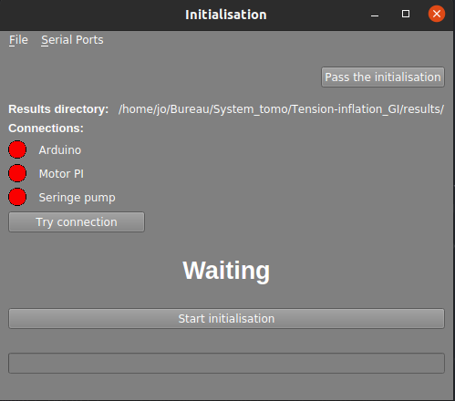
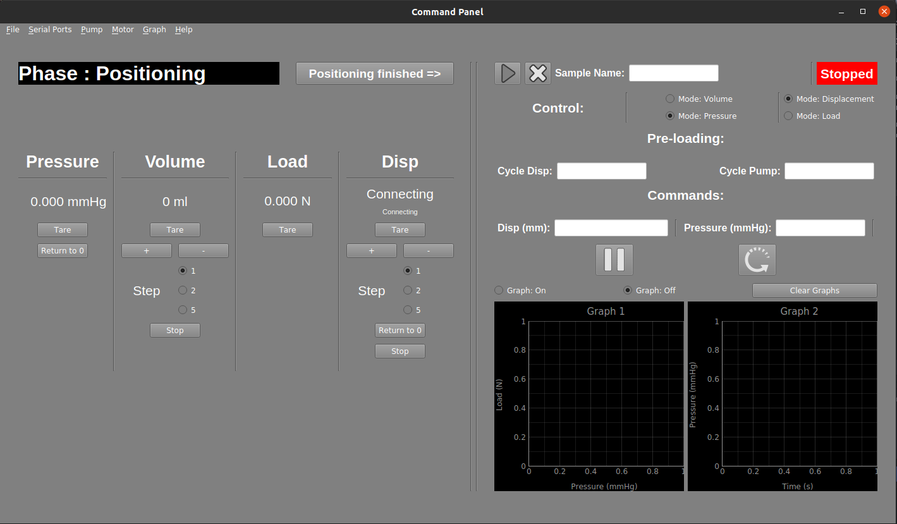

# Tension-inflation graphical interface

[Custom foo description](#project-organisation)


[Contact](#contact)


---


# About The Project:

This graphical interface was developped to be used with the tension-inflation device based at Ecole des Mines de Saint-Etienne (France).


## Project organisation:

The project organisation is the following one:

```
── GUI_main.py                       #Main script to execute to start the GUI
├── Arduino_script                   #Folder with the Arduino script uploaded on the card (written in C++)
├── modules
│   ├── mainwindow_modules
│   │   ├── Left_panel.py            # Left panel of the mainwindow
│   │   └── Right_panel.py           # Right panel of the mainwindow
│   ├── sensors_dialogs
│   │   ├── Arduino.py               # Script for the dialog with the Arduino
│   │   ├── MotorPI.py               # Script for the dialog with the Motor
│   │   ├── Pump_seringe.py          # Script for the dialog with the Pump
│   │   └── PumpWM.py                # Script for the dialog with the Watson Marlow pump (not useful)
│   ├── initialisation.py            # GUI of the step 1
│   └── mainwindow.py                # GUI of the step 2 composed in right and left panels
├── ressources                       # Folder with the images
└── results                          # Folder containing the output from the software
```


---
# Getting Started:


## Requirements

### Python packages required :

* pyqt==5.9.2                 ==>  (https://anaconda.org/anaconda/pyqt)
* pyserial==3.5             ==>  (https://anaconda.org/anaconda/pyserial)
* pyqtgraph==0.11.0            ==>  (https://anaconda.org/anaconda/pyqtgraph)
* simple-pid==0.2.4           ==>  (https://anaconda.org/esrf-bcu/simple-pid)
* PIPython==2.5.0.1             ==>  (https://pypi.org/project/PIPython/)


### Drivers required :

* Driver PI C663 (install from the PI cd - 'http://update.pi-portal.ws/down.php?link=http://syst13.synserver.de/PIUpdateFinder/PI_C-990_CD1_V_1_0_0_6.zip&name=PI_C-990_CD1_V_1_0_0_6.zip&id=6'  or 'https://drive.google.com/file/d/1h9WOYUCOherfxR1k2YsRopm3UeD3EEEO/view?usp=sharing')
	* Folder 'linux' if linux os
	* '.exe' if Windows os


## Installation

Three methods to run the app:

1. Two standelone files were created (one for Windows and one for Linux) to avoid installing all the dependencies and execute the application directly.

2. Write in terminal: 'python sertup.py install'

3. Install all dependencies and launch 'entry_point.py'

Just one of these methods is needed.


## Software steps:


After executing `GUI_main.py` (and if all the python packages and drivers were installed on the computer), the GUI steps will be:


If you are on linux don't forget to add your user into dialout group for serial access with:
```
$ sudo usermod -a -G dialout YOUR_USERNAME
```
You can verify if the user is present in the dialout group by using the command:
```
$ groups
```

### Step 1 : Initialisation


The initialisation will be launched (code in `initialisation.py`). The objectives of this step are to connected the Arduino, the Pump, and the Motor, and to let the motor find its position. This window will appear:




* The button `Pass the initialisation` is to pass to the step 2 directly.
* The result directory is where the output of the test will be printed
* The connection show if the different devices are connected or not (green = connected). The button `Try connection` is to try to establish the connection with the devices
* The button `Start initialisation` is to let the motor find the limit sensor in order to know its displacement position.


### Step 2 : Main window


The main window will be launched (code in `mainwindow.py`). This window will appear:



The main window is divided into two panel: the `Left Panel` and the `Right Panel`.

The `Left Panel`: use to place control the values of the different quantities in real time and to place the sample in the initiale conditions before the beginning of the tension-inflation test.

Once the sample is place in the good conditions (in term of displacement and pressure), one can press the button `Positioning finished =>` to pass to the right panel

The `Right Panel`: use to launch the tension-inflation test.
* The `mode:Volume/Pressure` correspond to the control of the pump in pressure or in volume.
* The `mode:Displacement/Load` correspond to the control of the motor in displacement or in load.
* In `cycle Motor/Pump` you can enter the number of cycles you want before the motor or the pump stop to the final target (nothing enter = no cycles).
* In `Commands` you can enter the target displacement/pressure (nothing enter = no command). 

---


# Contact

Joseph Brunet - Mail: jo.brunet73@gmail.com

Project Link - https://github.com/JosephBrunet/tension_inflation.git

